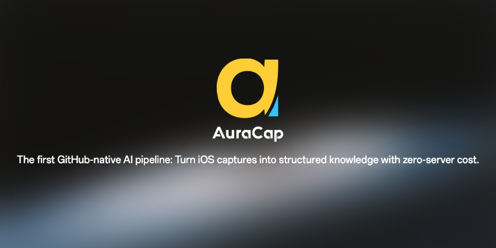

> 让每一次截图与录音，都成为可追溯、可复用的长期资产。 | Turn every screenshot and recording into traceable, reusable long-term assets.

[](https://github.com/massif-01/AuraCap#unique-innovation-github-release-as-transient-middleware)
[](https://github.com/massif-01/AuraCap)
[](https://github.com/massif-01/AuraCap/blob/main/docs/GITHUB_RELEASE_INBOX.md)
[](https://github.com/massif-01/AuraCap/tree/main/shortcuts)
[](.)
[](LICENSE)
[](https://www.python.org/)

---

**Language / 语言**：[中文](#中文) | [English](#english)

---

<a name="中文"></a>
## 中文

### 介绍

AuraCap 是首个将 **GitHub Release 作为瞬态中间件**（Transient Middleware）的开源项目：iOS 快捷指令把截图或录音上传至 Release Assets，GitHub Actions 自动拉取、AI 处理并写入时间线——全程在 GitHub 安全边界内闭环，无需 S3、无需图床、无需暴露 Webhook。**Fork 仓库即完成部署，运行成本为零。**

### 解决什么问题

多数信息系统的记录与整理是两件事：当下来不及整理，事后很难回到现场。而大多数"零成本"方案的代价是暗中依赖第三方存储，或将你锁在特定平台。AuraCap 用一种"黑客精神"解开这个结：让 GitHub 自身的基础设施承担全部中转与处理，让"捕捉"天然通向"沉淀"，数据始终由你掌控。

### 为什么选择 Shortcuts（快捷指令）作为入口

选择 Shortcuts，不是为了"更酷"，而是为了降低长期使用门槛。

- **贴近真实场景**：在通勤、会议、阅读或对话中，需要的是一步可达，而不是切换到重应用再组织流程
- **交互轻量且稳定**：快捷指令是系统级能力，调用链路短、交互负担低，适合高频、低摩擦的日常记录
- **系统边界清晰**：前端交互极简，后端能力可独立演进；可以替换模型、切换部署方式，而不必重做采集入口
- **更容易被坚持**：真正产生价值的记录系统，不是功能最多，而是愿意每天都用

### 特点

- **入口轻，能力重**：采集通过快捷指令完成，整理由 AI 自动执行
- **部署路径灵活**：可自部署后端，也可仅依赖 GitHub 工作流；后者无需自建服务器
- **输出长期可控**：统一写入 Markdown（如 `storage/timeline.md`），便于检索、归档、迁移与备份
- **模型生态开放**：支持 OpenAI、Gemini、SiliconFlow、Anthropic、Groq、Mistral 等模型及平台

<a name="unique-innovation-github-release-as-transient-middleware"></a>

### 架构设计：为什么选择 GitHub Release 作为"瞬态媒体中转站"

AuraCap 可能是首个提出并实现 "GitHub Release as a Transient Middleware"（将 GitHub Release 作为瞬态中间件）的开源项目。

在设计 AuraCap 时，我面临一个核心矛盾：**如何在不依赖付费 S3 存储、不自建图床、且不暴露 Webhook 代理的情况下，让 iOS 快捷指令与 GitHub Actions 传递大体积媒体文件，实现零外部依赖的媒体采集与处理，把 GitHub Release 变成模型的预处理器？**

AuraCap 最终采取了一种些许"黑客精神"的方案：**利用 GitHub Release Assets 作为异步中转。**

1. **打破"静态发布"的刻板印象**：通常 Release 用于托管稳定的二进制包，但我将其视为一个 **带身份认证的临时对象存储（Object Storage）**。
2. **利用 `asset_id` 建立信任链**：
   - iOS 端通过 API 将截图/录音上传至特定的 `Inbox` Release。
   - 上传成功后，GitHub 返回一个唯一的 `asset_id`。
   - 快捷指令仅需携带这个 `asset_id` 触发 `workflow_dispatch`，而无需传输整个文件。
3. **零配置的安全内循环**：
   - GitHub Actions 环境中自带 `GITHUB_TOKEN`，拥有拉取本仓库 Release Assets 的天然权限。
   - 处理脚本根据 `asset_id` 直接下载、处理、写入。
   - **闭环完成**：整个过程不产生额外的存储费用，不依赖第三方 API Key，且媒体流始终在 GitHub 安全边界内流动。

### 选择使用方式

| 方式 | 条件 | 特点 |
|------|------|------|
| **GitHub-only** | 不希望维护服务器，希望尽量简化运维 | 上传截图至 Release 后触发 Workflow 自动处理 |
| **自部署** | 有服务器，或本机可运行 Python / Docker | iOS 直接连接你的 API，响应快、可控性高 |

两种方式都可独立使用：前者强调低维护成本与开箱即用，后者强调实时性与控制力。

### 快速上手

**GitHub-only（推荐）**

1. Fork 本仓库（**隐私提醒**：Fork 后请将仓库设为 Private，否则截图/录音会对外可见）
2. 在仓库 `Settings -> Secrets and variables -> Actions` 中配置必要变量（如 TEXT_PROVIDER、MM_PROVIDER、OUTPUT_LOCALE 等，可先使用 `mock` 跑通流程；mock 模式无需 Secrets；使用真实模型时需在 Secrets 页签添加 API Key（如 OPENAI_API_KEY）；详见 [GITHUB_RELEASE_INBOX 步骤 2](docs/GITHUB_RELEASE_INBOX.md#步骤-2配置-variables-与-secrets)）
3. 运行一次 `AuraCap Setup Release Inbox` 工作流
4. 按用户手册在 iPhone 上搭好快捷指令（或 [下载已脱敏模板（截图）](https://www.icloud.com/shortcuts/9769e33cd988439b93f24f1ffc462ae8)、[快捷指令模板（录音）](https://www.icloud.com/shortcuts/d8e7e6e49abc47318a5771c57f49a226)、[快捷指令模板（拍照）](https://www.icloud.com/shortcuts/a316724f90d3481fa28d563214d0d3e0)，导入后仅填写个人信息即可）

建议首次先使用 `mock` 模式完成端到端验证，再切换为 OpenAI、Gemini 等真实模型。详细步骤见 [用户手册](docs/USERGUIDE.md)。

**自部署（3 步）**

```bash
git clone <your-fork-or-repo-url>
cd AuraCap
cp .env.example .env
python -m venv .venv
source .venv/bin/activate  # Windows: .venv\Scripts\activate
pip install -r requirements.txt
python backend/main.py
```

或使用 Docker：`docker compose up -d --build`。浏览器访问 `http://127.0.0.1:8000/health`，出现响应即表示服务启动成功。首次运行快捷指令时会提示输入 AuraCap Backend Base URL（如 `http://192.168.1.23:8000` 或 `https://cap.yourdomain.com`）。

### 会得到什么输出

- `storage/timeline.md`：按时间顺序记录条目，包含 AI 提取结果
- `storage/insights/`：每日洞察（默认每天一次，可配置）
- `storage/summary/`：定期摘要（默认每周一次，可配置）
- `storage/task_index/`：任务索引（按 tag 权重的日/周索引，默认每日生成）
- `storage/customized/`：自定义操作输出（需启用 `ENABLE_CUSTOM_OPERATION`）

所有结果均为 Markdown，可同步到 Notion、Obsidian 或任意知识管理系统。你的数据结构不会被平台锁定，也便于长期积累与二次利用。调度频率与 cron 配置见 [用户手册 3.5 自动化调度](docs/USERGUIDE.md#35-自动化调度)。

### 提示词说明

AuraCap 使用五类提示词驱动 AI 分析，均位于 `prompts/` 目录：

| 提示词 | 作用 | 触发时机 |
|--------|------|----------|
| `timeline_prompts.md` | 从截图或录音中提取核心信息，写入 timeline | 每次截图/录音时 |
| `insights_prompts.md` | 通读当日 timeline，发现跨条目的模式与未完成信号 | 每日定时（默认 UTC 01:00） |
| `summary_prompts.md` | 纵向分析一段时间内的 timeline + insights，归纳轨迹与建议 | 每周定时（默认周日 UTC 02:00） |
| `tagging_zh.md` / `tagging_en.md` | 为 timeline 条目生成 1–3 个语义 tag，供任务索引使用 | 每日定时（与 insights 同 cron） |
| `customized_prompts.md` | 对 timeline 提取结果做额外 AI 处理，输出到 `storage/customized/` | 每次捕捉后或按 cron 定时（需启用 `ENABLE_CUSTOM_OPERATION`） |

Timeline 支持 4 套场景化提示词（截图/录音 × 中文/英文），insights 与 summary 各支持中英文 2 套；通过 `TIMELINE_LANG_MODE` 与 `OUTPUT_LOCALE` 控制语言路由。默认 timeline 提示词针对 **iOS 截图** 优化（过滤状态栏等系统噪音）。若你主要使用**录音**，可自行修改 `prompts/timeline_prompts.md`，或通过 `TIMELINE_PROMPT_FILE` 指定自己的文件；自定义操作提示词可通过 `CUSTOMIZED_PROMPT_FILE` 指定路径。**OpenAI 兼容**：`OPENAI_*` 变量适用于 OpenAI 官方及 SiliconFlow、OpenRouter、DeepSeek 等兼容服务，接入第三方时改 `OPENAI_BASE_URL` 即可。详见 [用户手册 3.6 提示词](docs/USERGUIDE.md#36-提示词)。

### 下一步

- 完整配置与模型选择：[docs/USERGUIDE.md](docs/USERGUIDE.md)
- GitHub-only 详细说明：[docs/GITHUB_RELEASE_INBOX.md](docs/GITHUB_RELEASE_INBOX.md)
- 快捷指令模板与手动搭建：[shortcuts/README.md](shortcuts/README.md)

### 协议

[MIT License](LICENSE)

---

<a name="english"></a>
## English

### Introduction

AuraCap is the first open-source project to implement **GitHub Release as Transient Middleware**: iOS Shortcuts upload screenshots or recordings to Release Assets; GitHub Actions then fetches, processes via AI, and writes to a timeline — fully closed-loop within GitHub's security boundary, no S3, no image hosting, no exposed webhooks. **Forking the repository is the entire deployment. Running cost: zero.**

### The Problem It Solves

Most information tools split recording and organizing into two separate acts: you never have time to organize in the moment, and it's hard to return to the context later. Most "zero-cost" solutions quietly depend on third-party storage or lock your data into a platform. AuraCap resolves this with a touch of hacker ingenuity: GitHub's own infrastructure handles all the relay and processing, so "capture" naturally leads to "consolidation" — and you always own your data.

### Why Shortcuts as the Entry Point

Choosing Shortcuts is not about being "cooler"—it's about lowering the barrier for long-term use.

- **Close to real scenarios**: When commuting, in meetings, reading, or in conversations, you need one-tap access, not switching to a heavy app and orchestrating a flow
- **Lightweight, stable interaction**: Shortcuts are a system-level capability; the call path is short, the interaction burden is low, suitable for high-frequency, low-friction daily capture
- **Clear system boundaries**: Minimal frontend, backend can evolve independently; you can swap models and deployment modes without rebuilding the capture entry
- **Easier to stick with**: A recording system that actually adds value is not the one with the most features, but the one you're willing to use every day

### Features

- **Light entry, heavy capability**: Capture via Shortcuts, organization by AI
- **Flexible deployment**: Self-host a backend or rely solely on GitHub workflows; the latter requires no server
- **Long-term control over output**: Everything written to Markdown (e.g. `storage/timeline.md`), easy to search, archive, migrate, and back up
- **Open model ecosystem**: Supports OpenAI, Gemini, SiliconFlow, Anthropic, Groq, Mistral, and other models/platforms

### Architecture: Why Use GitHub Release as a "Transient Media Relay"

AuraCap may be the first open-source project to propose and implement "GitHub Release as a Transient Middleware."

The core design challenge was: **How can iOS Shortcuts and GitHub Actions pass large media files without paid S3 storage, self-hosted image hosting, or exposed webhook proxies—achieving zero external dependencies for media capture and processing, turning GitHub Release into the model's preprocessor?**

AuraCap's answer: **Use GitHub Release Assets as an asynchronous relay.**

1. **Rethinking Release**: Instead of treating Release only as a place for stable binaries, we treat it as **authenticated temporary object storage**.
2. **Trust chain via `asset_id`**:
   - iOS uploads screenshots/recordings to a dedicated Inbox Release via API.
   - GitHub returns a unique `asset_id`.
   - The shortcut passes only this `asset_id` to trigger `workflow_dispatch`—no need to transmit the full file.
3. **Zero-config secure loop**:
   - GitHub Actions has `GITHUB_TOKEN` with built-in permission to fetch the repo's Release Assets.
   - The processing script downloads, processes, and writes based on `asset_id`.
   - **Closed loop**: No extra storage cost, no third-party API keys, and the media flow stays within GitHub's security boundary.

### Choose Your Mode

| Mode | Requirement | Characteristics |
|------|-------------|-----------------|
| **GitHub-only** | No server maintenance; minimal ops | Upload to Release, trigger Workflow; processing is automatic |
| **Self-host** | Server or local Python/Docker | iOS connects directly to your API; fast response, full control |

Both can be used independently: the former emphasizes low maintenance and out-of-the-box use, the latter emphasizes real-time control.

### Quick Start

**GitHub-only (recommended)**

1. Fork this repository (**Privacy**: Set your fork to Private, or screenshots/recordings will be publicly visible.)
2. Configure required variables under `Settings -> Secrets and variables -> Actions` (e.g. TEXT_PROVIDER, MM_PROVIDER, OUTPUT_LOCALE; use `mock` first to verify; mock mode needs no Secrets; for real models add API key in Secrets (e.g. OPENAI_API_KEY); see [GITHUB_RELEASE_INBOX Step 2](docs/GITHUB_RELEASE_INBOX.md#step-2-configure-variables-and-secrets))
3. Run the `AuraCap Setup Release Inbox` workflow once
4. Set up the shortcut on your iPhone following the [user guide](docs/USERGUIDE.md) (or [Screenshot template](https://www.icloud.com/shortcuts/9769e33cd988439b93f24f1ffc462ae8), [Voice template](https://www.icloud.com/shortcuts/d8e7e6e49abc47318a5771c57f49a226), [Photo template](https://www.icloud.com/shortcuts/a316724f90d3481fa28d563214d0d3e0)—fill in your personal info only)

Start with `mock` mode to complete an end-to-end run, then switch to OpenAI, Gemini, or other real models. See [docs/USERGUIDE.md](docs/USERGUIDE.md) for details.

**Self-host (3 steps)**

```bash
git clone <your-fork-or-repo-url>
cd AuraCap
cp .env.example .env
python -m venv .venv
source .venv/bin/activate  # Windows: .venv\Scripts\activate
pip install -r requirements.txt
python backend/main.py
```

Or use Docker: `docker compose up -d --build`. Visit `http://127.0.0.1:8000/health` in your browser; a response means the service is up. On first run, the shortcut will prompt for AuraCap Backend Base URL (e.g. `http://192.168.1.23:8000` or `https://cap.yourdomain.com`).

### Output

- `storage/timeline.md`: Time-ordered entries with AI-extracted content
- `storage/insights/`: Daily insights (default: once per day, configurable)
- `storage/summary/`: Periodic summaries (default: once per week, configurable)
- `storage/task_index/`: Task index (tag-weighted daily/weekly index, generated daily by default)
- `storage/customized/`: Custom operation output (requires `ENABLE_CUSTOM_OPERATION`)

All output is Markdown and can be synced to Notion, Obsidian, or any knowledge management system. Your data format stays platform-agnostic and supports long-term accumulation and reuse. For schedule frequency and cron configuration, see [User Guide 3.5 Scheduler](docs/USERGUIDE.md#35-scheduler).

### Prompts

AuraCap uses five prompt files under `prompts/` to drive AI analysis:

| Prompt | Purpose | Trigger |
|--------|---------|---------|
| `timeline_prompts.md` | Extract key info from screenshots or recordings into timeline | On each capture |
| `insights_prompts.md` | Analyze the day's timeline for patterns and open threads | Daily (default UTC 01:00) |
| `summary_prompts.md` | Longitudinal analysis of timeline + insights over a period | Weekly (default Sunday UTC 02:00) |
| `tagging_zh.md` / `tagging_en.md` | Assign 1–3 semantic tags per timeline entry for task indexing | Daily (same cron as insights) |
| `customized_prompts.md` | Extra AI processing on timeline extract results, output to `storage/customized/` | After each capture or on cron schedule (requires `ENABLE_CUSTOM_OPERATION`) |

Timeline supports four scenario-specific prompts (screenshot/audio × Chinese/English); insights and summary each support two language variants. Language routing is controlled by `TIMELINE_LANG_MODE` and `OUTPUT_LOCALE`. The default timeline prompt is tuned for **iOS screenshots** (filtering status bar etc.). If you mainly use **voice recordings**, customize `prompts/timeline_prompts.md` or set `TIMELINE_PROMPT_FILE` to your own file; custom operation prompt path can be set via `CUSTOMIZED_PROMPT_FILE`. **OpenAI compatible**: `OPENAI_*` variables apply to OpenAI official and SiliconFlow, OpenRouter, DeepSeek, etc.; for third-party, change `OPENAI_BASE_URL`. See [User Guide 3.6 Prompts](docs/USERGUIDE.md#36-prompts).

### Next Steps

- Full configuration and model selection: [docs/USERGUIDE.md](docs/USERGUIDE.md)
- GitHub-only setup details: [docs/GITHUB_RELEASE_INBOX.md](docs/GITHUB_RELEASE_INBOX.md)
- Shortcut templates and manual setup: [shortcuts/README.md](shortcuts/README.md)

### License

[MIT License](LICENSE)
