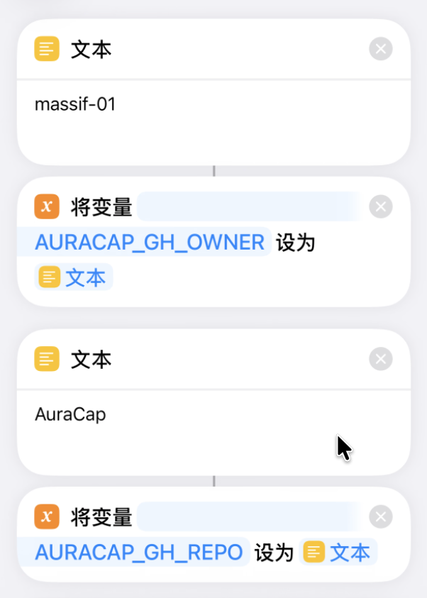
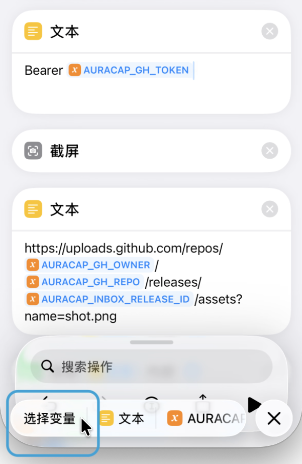
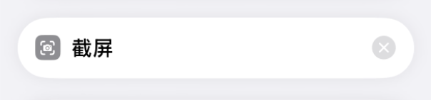
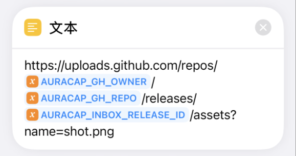
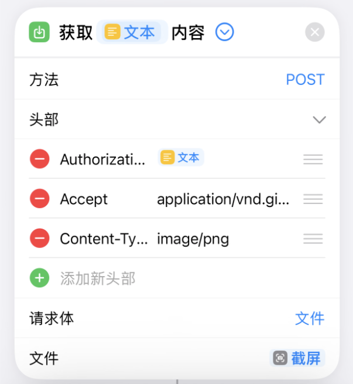
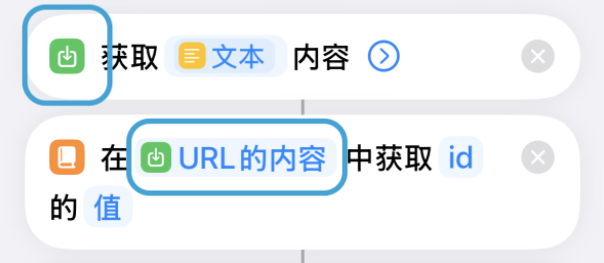
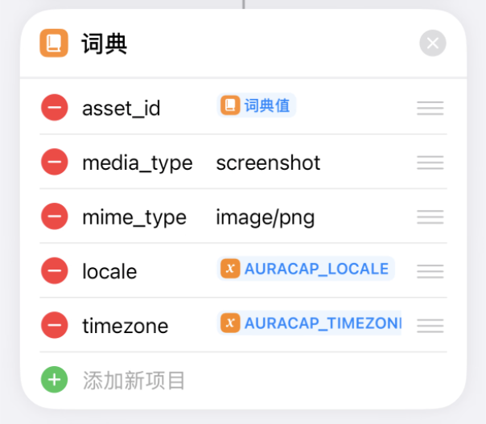
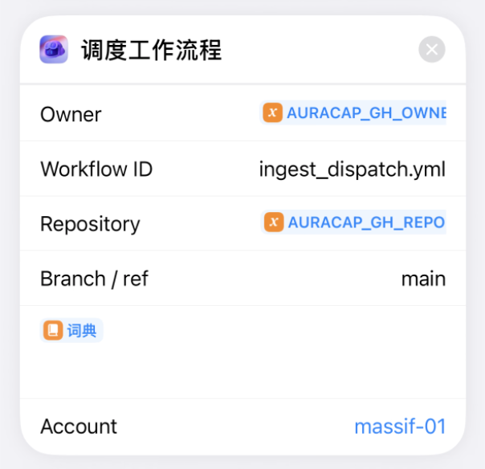
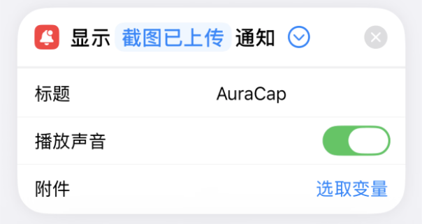

# AuraCap GitHub-only: Release Inbox Mode

**Language / 语言**：[中文](#中文) | [English](#english)

---

<a name="中文"></a>
## 中文

本指南按实测通过的流程编写，帮助你从零搭建 GitHub-only 模式。**前置条件**：iPhone 已安装 [GitHub App](https://apps.apple.com/app/github/id1477376905) 并登录你的 GitHub 账号。

---

### 一、在 GitHub 上的准备

### 步骤 1：Fork 仓库

Fork `AuraCap` 到你自己的 GitHub 账号，后续所有操作都在你的 fork 上。

**隐私提醒**：截图/录音会上传到 Release，可能含敏感信息。Fork 后默认是公开仓库，请务必在 `Settings -> General` 中将其设为 **Private**，否则任何人可访问你的 Release 文件。

### 步骤 2：配置 Variables

进入 `Settings -> Secrets and variables -> Actions`，点 `Variables` 页签，添加：

| 变量名 | 值 | 用途 |
|--------|-----|------|
| `TEXT_PROVIDER` | `mock` | 文本分析（insights、summary、录音转写后分析） |
| `MM_PROVIDER` | `mock` | 多模态（截图分析、DIRECT_MULTIMODAL 下录音） |
| `ASR_PROVIDER` | `mock` | 语音转文字（仅 TRANSCRIBE_THEN_ANALYZE 模式） |
| `OUTPUT_LOCALE` | `zh-CN` | 输出语言（`zh-CN` 或 `en-US`；insights/summary 提示词、timeline 标题） |
| `DEFAULT_TIMEZONE` | `local` | timeline 条目和 insights/summary 中时间戳的时区 |
| `AURACAP_RELEASE_INBOX_TAG` | `auracap-inbox` | 存放待处理截图/录音的 Release 的 tag 名称（与步骤 4 创建的 Release 对应） |
| `AURACAP_RELEASE_DELETE_AFTER_PROCESS` | `true` | 处理完成后是否从 Release 上删除已上传的截图/录音文件；`false` 时文件会保留并堆积 |
| `UNIFIED_PROVIDER`（可选） | 留空 | 统一模式：设为 `openai`、`google` 等时，TEXT/MM/ASR 均用同一 provider；设后 TEXT_PROVIDER/MM_PROVIDER/ASR_PROVIDER 可省略 |

**存储提醒**：`AURACAP_RELEASE_DELETE_AFTER_PROCESS=false` 时，文件会留在 Release 中累积。GitHub 仓库有大小限制（软限制约 1GB），超出后新上传会失败，建议保持 `true`。

完整变量说明见 [USERGUIDE 3.7 变量参考速查表](USERGUIDE.md#37-变量参考速查表)。

**必配与可选**：mock 模式下上述 Variables 均可不配（全用默认），无需 Secrets 即可完成端到端验证。使用真实模型时，必须配置对应 provider 的 Secret（如 `OPENAI_API_KEY`）以及 `TEXT_PROVIDER`/`MM_PROVIDER`/`ASR_PROVIDER`（或 `UNIFIED_PROVIDER`）为非 mock；缺 key 会导致 `AUTH_FAILED`。详见 [USERGUIDE 3.7 变量必配/可选与后果](USERGUIDE.md#37-变量参考速查表)。

说明：GitHub 禁止变量名以 `GITHUB_` 开头，故 Actions Variables 使用 `AURACAP_` 前缀（如 `AURACAP_RELEASE_INBOX_TAG`）；workflow 内部会映射为 `GITHUB_RELEASE_*` 传给处理脚本。mock 模式无需配置 Secrets，即可完成端到端验证。

`OUTPUT_LOCALE` 同时控制 insights/summary 的提示词语言，以及 timeline 在 `request_locale` 模式下的提示词选择。快捷指令中的 `AURACAP_LOCALE` 在每次请求时传入，同样决定 timeline 输出语言（当 `TIMELINE_LANG_MODE=request_locale` 时）。

**可选**：`TIMELINE_LANG_MODE`（默认 `request_locale`）可设为 `content_detect`，让 timeline 自动检测截图/录音内容语言选提示词；截图每次会多一次多模态模型调用。

若使用真实模型（OpenAI、Gemini、SiliconFlow 等），需额外配置 Variables 和 Secrets，详见 [USERGUIDE 配置说明](USERGUIDE.md#3-配置说明两条路径通用)。使用 OpenAI 兼容第三方（SiliconFlow、OpenRouter、DeepSeek 等）时，用 `OPENAI_*` 变量（`OPENAI_BASE_URL`、`OPENAI_API_KEY` 等）；`OPENAI_*` 适用于所有 OpenAI API 兼容服务。

**可选：调度配置**：`ENABLE_SCHEDULER`（默认 `true`）控制是否运行 insights/summary 定时任务；设为 `false` 可完全关闭。其余调度变量（`INSIGHTS_CRON`、`SUMMARY_CRON` 等）详见 [USERGUIDE 3.5 自动化调度](USERGUIDE.md#35-自动化调度)。

### 步骤 3：创建 Fine-grained Token

1. GitHub 右上角头像 -> `Settings`
2. 左侧底部 -> `Developer settings`
3. `Personal access tokens` -> `Fine-grained tokens` -> `Generate new token`
4. 填写：`Token name`（如 `auracap-ios`），`Expiration`（如 90 天），`Repository access` 选 `Only select repositories` 并勾选你的 AuraCap fork
5. `Repository permissions` -> `Contents` 设为 `Read and write`
6. 生成后**立即复制 token**（只显示一次），建议先保存在备忘录，后面填到快捷指令里

### 步骤 4：初始化 Release Inbox

1. 进入仓库 `Actions` 页面
2. 左侧选择 `AuraCap Setup Release Inbox`
3. 点击 `Run workflow` -> `Run workflow`
4. 运行完成后，点击该次运行 -> 点击 job `setup` -> 展开步骤 **`Ensure release inbox exists`**
5. 在步骤输出的 JSON 中找到 `"release_id": 123456789` 格式，复制其中的数字，保存到备忘录

---

### 二、在 iPhone 上搭快捷指令

> **快捷方式：若不想从头手动配置，可 [下载已脱敏的快捷指令模板（截图）](https://www.icloud.com/shortcuts/4fe8f67fe232424d8df5e85f1877e985)、[快捷指令模板（录音）](https://www.icloud.com/shortcuts/19b273bd82af4458aee7623f79dd7f11)，导入后只需填写你的 GitHub 用户名、Token、`release_id` 等个人信息即可使用。**

### 步骤 5：新建快捷指令并添加变量

**只建一个快捷指令**（可命名为「AuraCap 截图」）。在这个快捷指令里，**重复 6 次**以下组合：

1. **「文本」动作**：搜索「文本」，添加后往文本框里填**值**
2. **「设定变量」动作**：搜索「设定变量」，添加；上一步的文本会自动接到「输入」；**点「变量名称」那一行**，输入下表中的变量名

| 第几组 | 变量名（在「变量名称」里填） | 值（文本动作里填） | 必配/可选 |
|--------|-----------------------------|---------------------|-----------|
| 1 | `AURACAP_GH_OWNER` | 你的 GitHub 用户名（如 `massif-01`） | 必配；错则 404 |
| 2 | `AURACAP_GH_REPO` | `AuraCap`（若 fork 后改了仓库名，填新名） | 必配；错则 404 |
| 3 | `AURACAP_GH_TOKEN` | 步骤 3 复制的 token | 必配；错/过期则 401/403 |
| 4 | `AURACAP_INBOX_RELEASE_ID` | 步骤 4 得到的 `release_id` 数值 | 必配；错则 404 |
| 5 | `AURACAP_LOCALE` | `zh-CN` 或 `en-US`，建议与 Actions 的 OUTPUT_LOCALE 一致 | 可选；不传则用 OUTPUT_LOCALE |
| 6 | `AURACAP_TIMEZONE` | `local` 或 IANA 时区（如 `Asia/Shanghai`），建议与 DEFAULT_TIMEZONE 一致 | 可选；不传则用 DEFAULT_TIMEZONE |

上述快捷指令变量完整说明见 [USERGUIDE 3.7 变量参考速查表](USERGUIDE.md#37-变量参考速查表) 的「快捷指令变量」小节。

提示：底部搜索框输入「设定变量」或「变量」，在「脚本」分类里找；添加后该动作会显示「输入」「变量名称」两行，点「变量名称」即可输入名字。完成后共 12 个动作（6 组「文本」+「设定变量」），后面再接截屏、上传等。



**从这里开始，所有动作都在同一个快捷指令里，紧接在 12 个变量动作的下方按顺序添加。**

完整动作顺序（非常重要，不能乱）：
```
[12个变量]
→ 文本(Bearer)
→ 截屏
→ 文本(URL)
→ 获取 URL 内容
→ 获取词典值
→ 词典
→ 调度工作流程
→ 显示通知（可选）
```

### 步骤 6：添加「文本」——Bearer token

搜索「文本」，添加在 12 个变量动作的最下方。在文本框输入 `Bearer `（注意Bearer后面有**一个空格**），再点输入框 →「选择变量」→ 选 `AURACAP_GH_TOKEN`。

这一步必须放在截屏和上传之前，方便后面「获取 URL 内容」的头部直接引用。



### 步骤 7：添加「截屏」

搜索「截取屏幕」或「截屏」，添加在「文本(Bearer)」下方。



### 步骤 8：添加「文本」——拼接上传 URL

搜索「文本」，添加在「截屏」下方。在文本框里这样拼：

1. 先输入：`https://uploads.github.com/repos/`
2. 点一下输入框，弹出「选择变量」后选 `AURACAP_GH_OWNER`
3. 再输入：`/`
4. 点一下输入框，弹出「选择变量」后选 `AURACAP_GH_REPO`
5. 再输入：`/releases/`
6. 点一下输入框，弹出「选择变量」后选 `AURACAP_INBOX_RELEASE_ID`
7. 最后输入：`/assets?name=shot.png`

拼完后类似：`https://uploads.github.com/repos/massif-01/AuraCap/releases/123456789/assets?name=shot.png`



### 步骤 9：添加「获取 URL 内容」——上传截图

搜索「获取 URL 内容」，添加在「文本(URL)」正下方。此时标题栏自动接入上一步的 URL，不需要手动选。然后配置：

1. **方法**：点右侧「GET」→ 改成 **POST**，改完后出现「请求体」行。
2. **请求体**：点右侧「JSON」→ 改成 **文件**，改完后出现「文件」行。
3. **文件**：点「文件」右侧「选取变量」→ 直接点「**截屏**」即可。
4. **头部**：点「头部」右侧 `>` 展开 → 点「添加新头部」（绿色 ＋）→ 添加以下头部：

| 键（左栏输入） | 值（右栏输入） |
|----------------|----------------|
| `Authorization` | 点右边值栏 →「选择变量」→ 选「**文本(Bearer)**」（即步骤 6 的文本动作输出） |
| `Accept` | 直接输入 `application/vnd.github+json` |
| `Content-Type` | 直接输入 `image/png` |



### 步骤 10：添加「获取词典值」——取上传后的文件 ID

搜索「获取词典值」，添加在「获取 URL 内容」正下方。此时自动接入上一步的返回结果，不需要手动改。然后：

1. 点「**键**」→ 输入 `id`（即 GitHub 返回的 asset_id，用于标识刚上传的截图/录音文件）
2. 「获取」保持「值」不变



### 步骤 11：添加「词典」——构造传给 Workflow 的输入参数

搜索「**词典**」，添加。点「添加新项目」依次添加 5 个条目，每次点「添加新项目」后选「**文本**」类型。这些键值将作为「调度工作流程」的 Inputs 传给 GitHub Actions：

| 左边（键）填 | 右边（值）填 |
|-------------|-------------|
| `asset_id` | 点右边值栏 →「选择变量」→ 选「**获取词典值**」的输出（即步骤 10 取到的上传文件 ID） |
| `media_type` | 直接输入 `screenshot` |
| `mime_type` | 直接输入 `image/png` |
| `locale` | 点右边值栏 →「选择变量」→ 选 `AURACAP_LOCALE` |
| `timezone` | 点右边值栏 →「选择变量」→ 选 `AURACAP_TIMEZONE` |



### 步骤 12：添加「调度工作流程」

搜索「**调度工作流程**」，添加。每个字段右边是「文本」输入栏，点进去填：

| 字段 | 填法 |
|------|------|
| Owner | 点右边值栏 →「选择变量」→ 选 `AURACAP_GH_OWNER` |
| Workflow ID | 直接输入 `ingest_dispatch.yml` |
| Repository | 点右边值栏 →「选择变量」→ 选 `AURACAP_GH_REPO` |
| Branch / ref | 直接输入 `main` |
| Inputs | 点右边值栏 →「选择变量」→ 选上一步「词典」的输出 |
| Account | 已自动识别，无需修改 |

注意：**Inputs 灰色无法点击时**，先把 Owner、Workflow ID、Repository、Branch、Account 都填好，Inputs 才会变成可点击状态。



### 步骤 13：添加「显示通知」（可选）

搜索「**显示通知**」，添加。界面有两个输入栏：

- **「你好，世界！」**（通知正文）：可直接输入任意文字，如 `AuraCap 截图已上传`，或保持默认不改
- **「通知」右边的 `>`**：点进去可设置标题等，不需要可忽略

这一步纯粹用于确认快捷指令执行结束，不影响功能，也可以不加。



---

### 三、实测与验证

### 步骤 14：运行快捷指令

在 iPhone 上运行该快捷指令。会先截屏，再自动上传并触发 workflow。

### 步骤 15：验证成功

1. **快捷指令**：无报错、无「参数错误」提示
2. **GitHub Actions**：进入仓库 Actions，应看到 `AuraCap Ingest Dispatch` 有新运行记录
3. **存储**：该次运行成功后，`storage/timeline.md` 会有新提交和新内容
4. **Release 文件清理**：若 `AURACAP_RELEASE_DELETE_AFTER_PROCESS=true`，处理完成后会从 Release 上删除对应的截图/录音文件，保持 Release 清爽；`false` 时文件会保留并堆积。GitHub 仓库有大小限制（软限制约 1GB），超出后新上传会失败，建议保持 `true`。

---

### 四、常见问题

| 现象 | 可能原因 | 处理 |
|------|----------|------|
| Inputs 灰色 | 必填字段未填完 | 先填 Owner、Workflow ID、Repository、Branch、Account |
| 401 / 403 | Token 无效或权限不足 | 检查 Token 是否过期、是否勾选 Contents: Read and write |
| 404 | owner / repo / release_id 错误 | 核对变量值与仓库、Release 是否一致 |
| Action 未触发 | 参数缺失或错误 | 检查 Workflow ID 是否为 `ingest_dispatch.yml`，步骤 11 的词典是否包含 `asset_id`（上传后的文件 ID） |
| 新上传失败 | 仓库大小超限 | GitHub 仓库有软限制约 1GB，Release 文件累积会占用空间；将 `AURACAP_RELEASE_DELETE_AFTER_PROCESS` 设为 `true` 或手动清理 Release 中的旧文件 |

---

### 五、录音版快捷指令

在截图版基础上，修改以下三处：

1. 步骤 7「截取屏幕」改为「录制音频」
2. 步骤 9（上传）的 Header：`Content-Type` 改为 `audio/m4a`
3. 步骤 11（词典）：`media_type` 改为 `audio`，`mime_type` 改为 `audio/m4a`

其余步骤不变。

---

### 六、备选：无 GitHub App 时用手写 repository_dispatch

若你未安装或无法使用 GitHub App，可用「获取 URL 内容」直接向 GitHub API 发送 POST 来触发 workflow，替代「调度工作流程」动作。

**与主流程的差异**：上传和获取 `asset_id` 的步骤（步骤 5–10）与上述完全一致。差异在于步骤 11–13：

1. **步骤 11（词典）**：构造 `client_payload`，包含 `asset_id`、`media_type`、`mime_type`、`locale`、`timezone`（键名与上表相同）
2. **步骤 12**：再嵌套一层词典，键 `event_type` 填 `auracap_ingest`，键 `client_payload` 选上一步的词典输出
3. **步骤 13**：改用「获取 URL 内容」：
   - URL：`https://api.github.com/repos/<owner>/<repo>/dispatches`（`<owner>`、`<repo>` 用变量替换）
   - 方法：`POST`
   - 请求正文：`JSON`，选上一步嵌套词典
   - 头部：`Authorization`（Bearer + token）、`Accept`（`application/vnd.github+json`）、`Content-Type`（`application/json`）

成功后接口返回 `204 No Content`。后续验证与主流程相同。

---

<a name="english"></a>
## English

This guide follows a verified flow to set up GitHub-only mode from scratch. **Prerequisite**: iPhone has [GitHub App](https://apps.apple.com/app/github/id1477376905) installed and your GitHub account logged in.

---

### Part I: GitHub Preparation

#### Step 1: Fork the Repository

Fork `AuraCap` to your GitHub account. All following steps are on your fork.

**Privacy**: Screenshots/recordings are uploaded to Release and may contain sensitive data. Forks are public by default—set your repo to **Private** in `Settings -> General` or anyone can access your Release assets.

#### Step 2: Configure Variables

Go to `Settings -> Secrets and variables -> Actions`, click `Variables`, add:

| Variable | Value | Purpose |
|----------|-------|---------|
| `TEXT_PROVIDER` | `mock` | Text analysis (insights, summary, transcript analysis) |
| `MM_PROVIDER` | `mock` | Multimodal (screenshot, audio when DIRECT_MULTIMODAL) |
| `ASR_PROVIDER` | `mock` | Speech-to-text (only when TRANSCRIBE_THEN_ANALYZE) |
| `OUTPUT_LOCALE` | `zh-CN` | Output language (`zh-CN` or `en-US`; insights/summary prompts, timeline titles) |
| `DEFAULT_TIMEZONE` | `local` | Timezone for timestamps in timeline entries and insights/summary |
| `AURACAP_RELEASE_INBOX_TAG` | `auracap-inbox` | Tag name of the Release that holds pending screenshots/recordings (matches the Release created in Step 4) |
| `AURACAP_RELEASE_DELETE_AFTER_PROCESS` | `true` | After processing, delete the uploaded screenshot/audio file from the Release; `false` keeps files (they accumulate) |
| `UNIFIED_PROVIDER` (optional) | leave empty | Unified mode: set to `openai`, `google`, etc. to use one provider for TEXT/MM/ASR; when set, TEXT_PROVIDER/MM_PROVIDER/ASR_PROVIDER can be omitted |

**Storage**: When `AURACAP_RELEASE_DELETE_AFTER_PROCESS=false`, files accumulate in Release. GitHub repos have size limits (~1GB soft); new uploads will fail when exceeded. Keep `true` recommended.

Full variable reference: [USERGUIDE 3.7 Variable Reference](USERGUIDE.md#37-variable-reference-quick-lookup).

**Required vs optional**: In mock mode, all Variables can be left unset (defaults apply); no Secrets needed for end-to-end verification. For real models, configure the provider Secret (e.g. `OPENAI_API_KEY`) and set `TEXT_PROVIDER`/`MM_PROVIDER`/`ASR_PROVIDER` (or `UNIFIED_PROVIDER`) to non-mock; missing key causes `AUTH_FAILED`. See [USERGUIDE 3.7 Required vs Optional](USERGUIDE.md#37-variable-reference-quick-lookup).

Note: GitHub disallows variable names starting with `GITHUB_`, so Actions Variables use `AURACAP_` prefix (e.g. `AURACAP_RELEASE_INBOX_TAG`); the workflow maps these to `GITHUB_RELEASE_*` for the processing script. Mock mode needs no Secrets for end-to-end verification.

`OUTPUT_LOCALE` controls insights/summary prompt language and timeline prompt selection in `request_locale` mode. The shortcut variable `AURACAP_LOCALE` is sent per request and likewise determines timeline output language when `TIMELINE_LANG_MODE=request_locale`.

**Optional**: `TIMELINE_LANG_MODE` (default `request_locale`) can be set to `content_detect` to auto-detect screenshot/audio content language; screenshots add 1 multimodal model call per capture.

For real models (OpenAI, Gemini, SiliconFlow, etc.), add Variables and Secrets. See [USERGUIDE configuration](USERGUIDE.md#3-configuration-both-modes). For OpenAI-compatible third-party (SiliconFlow, OpenRouter, DeepSeek, etc.), use `OPENAI_*` variables (`OPENAI_BASE_URL`, `OPENAI_API_KEY`, etc.); `OPENAI_*` applies to all OpenAI API compatible services.

**Optional — Scheduler**: `ENABLE_SCHEDULER` (default `true`) controls whether insights/summary scheduled tasks run; set to `false` to fully disable. For other scheduler variables (`INSIGHTS_CRON`, `SUMMARY_CRON`, etc.), see [USERGUIDE 3.5 Scheduler](USERGUIDE.md#35-scheduler).

#### Step 3: Create Fine-grained Token

1. GitHub profile -> `Settings`
2. Bottom left -> `Developer settings`
3. `Personal access tokens` -> `Fine-grained tokens` -> `Generate new token`
4. Fill: `Token name` (e.g. `auracap-ios`), `Expiration` (e.g. 90 days), `Repository access` = `Only select repositories`, select your AuraCap fork
5. `Repository permissions` -> `Contents` = `Read and write`
6. **Copy token immediately** (shown once). Save in Notes, then paste into shortcut variables

#### Step 4: Initialize Release Inbox

1. Go to repo `Actions`
2. Select `AuraCap Setup Release Inbox`
3. Click `Run workflow` -> `Run workflow`
4. After run, click the run -> job `setup` -> expand step **`Ensure release inbox exists`**
5. In the step output JSON, find `"release_id": 123456789` and copy the number, save to Notes

---

### Part II: Build Shortcut on iPhone

> **Shortcut: Prefer not to configure from scratch? [Screenshot template](https://www.icloud.com/shortcuts/4fe8f67fe232424d8df5e85f1877e985), [Voice template](https://www.icloud.com/shortcuts/19b273bd82af4458aee7623f79dd7f11) (personal info already masked). Import one, then fill in your GitHub username, token, `release_id`, etc.**

#### Step 5: New Shortcut and Variables

**Create one shortcut** (e.g. "AuraCap Screenshot"). **Repeat 6 times**:

1. **"Text" action**: Search "Text", add, fill value
2. **"Set Variable" action**: Search "Set Variable", add; previous text auto-wires to "Input"; tap "Variable Name" row, enter name from table

| # | Variable name | Value | Required/Optional |
|---|---------------|-------|------------------|
| 1 | `AURACAP_GH_OWNER` | Your GitHub username | Required; wrong → 404 |
| 2 | `AURACAP_GH_REPO` | `AuraCap` (use new name if you renamed your fork) | Required; wrong → 404 |
| 3 | `AURACAP_GH_TOKEN` | Token from Step 3 | Required; wrong/expired → 401/403 |
| 4 | `AURACAP_INBOX_RELEASE_ID` | `release_id` from Step 4 | Required; wrong → 404 |
| 5 | `AURACAP_LOCALE` | `zh-CN` or `en-US`, align with OUTPUT_LOCALE | Optional; omitted → uses OUTPUT_LOCALE |
| 6 | `AURACAP_TIMEZONE` | `local` or IANA (e.g. `Asia/Shanghai`), align with DEFAULT_TIMEZONE | Optional; omitted → uses DEFAULT_TIMEZONE |

Full shortcut variable reference: [USERGUIDE 3.7 Variable Reference](USERGUIDE.md#37-variable-reference-quick-lookup) — "Shortcut Variables" section.

Tip: Search "Set Variable" or "variable" in Scripts. After adding, tap "Variable Name" to enter. Total 12 actions (6 Text + Set Variable pairs), then screenshot/upload.


**From here, all actions go in the same shortcut, below the 12 variable actions, in order.**

Action sequence (order matters):
```
[12 variables]
→ Text(Bearer)
→ Take Screenshot
→ Text(URL)
→ Get Contents of URL
→ Get Dictionary Value
→ Dictionary
→ Run Workflow
→ Show Notification (optional)
```

#### Step 6: Add "Text" — Bearer token

Search "Text", add below the 12 variable actions. In text box enter `Bearer ` (one space after), then tap input -> "Select Variable" -> `AURACAP_GH_TOKEN`.

Must be before screenshot/upload so "Get Contents of URL" headers can reference it.


#### Step 7: Add "Take Screenshot"

Search "Take Screenshot" or "Screenshot", add below "Text(Bearer)".


#### Step 8: Add "Text" — Upload URL

Search "Text", add below Screenshot. Build URL:
1. Enter `https://uploads.github.com/repos/`
2. Tap input -> Select Variable -> `AURACAP_GH_OWNER`
3. Enter `/`
4. Select Variable -> `AURACAP_GH_REPO`
5. Enter `/releases/`
6. Select Variable -> `AURACAP_INBOX_RELEASE_ID`
7. Enter `/assets?name=shot.png`

Result: `https://uploads.github.com/repos/massif-01/AuraCap/releases/123456789/assets?name=shot.png`


#### Step 9: Add "Get Contents of URL" — Upload

Search "Get Contents of URL", add below "Text(URL)". URL auto-wired. Configure:
1. **Method**: Change GET to **POST**
2. **Request Body**: Change JSON to **File**; select "Screenshot" as file
3. **Headers**: Add `Authorization` (Text(Bearer) output), `Accept` = `application/vnd.github+json`, `Content-Type` = `image/png`


#### Step 10: Add "Get Dictionary Value" — uploaded file ID

Search "Get Dictionary Value", add below previous. Key = `id` (GitHub returns this as asset_id to identify the uploaded screenshot/audio file), Get = "Value".


#### Step 11: Add "Dictionary" — Workflow inputs

Search "Dictionary", add. Add 5 items; these become the Inputs passed to "Run Workflow": `asset_id` (Get Dictionary Value output from Step 10), `media_type` = `screenshot`, `mime_type` = `image/png`, `locale` (variable), `timezone` (variable).


#### Step 12: Add "Run Workflow"

Search "Run Workflow" (GitHub action). Fill: Owner, Workflow ID = `ingest_dispatch.yml`, Repository, Branch = `main`, Inputs (Dictionary output), Account (auto).

Note: If Inputs is grey, fill Owner, Workflow ID, Repository, Branch, Account first.


#### Step 13: Add "Show Notification" (optional)

Search "Show Notification", add. Optional, for confirmation.


---

### Part III: Test and Verify

#### Step 14: Run Shortcut

Run the shortcut on iPhone. It screenshots, uploads, and triggers the workflow.

#### Step 15: Verify Success

1. **Shortcut**: No error, no "parameter error"
2. **GitHub Actions**: New run of `AuraCap Ingest Dispatch`
3. **Storage**: New commit and content in `storage/timeline.md`
4. **Release file cleanup**: If `AURACAP_RELEASE_DELETE_AFTER_PROCESS=true`, the uploaded screenshot/audio file is deleted from the Release after processing; `false` keeps files (they accumulate). GitHub repos have size limits (~1GB soft); exceeding causes new uploads to fail. Keep `true` recommended.

---

### Part IV: Common Issues

| Symptom | Cause | Fix |
|---------|-------|-----|
| Inputs grey | Required fields empty | Fill Owner, Workflow ID, Repository, Branch, Account |
| 401 / 403 | Token invalid or lacking permissions | Check expiry, Contents: Read and write |
| 404 | owner / repo / release_id wrong | Verify variable values |
| Action not triggered | Parameter error | Check Workflow ID = `ingest_dispatch.yml`, Dictionary from Step 11 has `asset_id` (uploaded file ID) |
| New upload fails | Repo size exceeded | GitHub repos have ~1GB soft limit; Release files count. Set `AURACAP_RELEASE_DELETE_AFTER_PROCESS=true` or manually delete old Release assets |

---

### Part V: Voice Recording Shortcut

Same as screenshot. Change:
1. Step 7: "Take Screenshot" -> "Record Audio"
2. Step 9 Header: `Content-Type` -> `audio/m4a`
3. Step 11 Dictionary: `media_type` = `audio`, `mime_type` = `audio/m4a`

---

### Part VI: Fallback — Hand-written repository_dispatch (no GitHub App)

If you don't use GitHub App, use "Get Contents of URL" to POST to GitHub API instead of "Run Workflow".

**Difference from main flow**: Steps 5–10 unchanged. Steps 11–13 differ:
1. **Step 11 (Dictionary)**: `client_payload` with `asset_id`, `media_type`, `mime_type`, `locale`, `timezone`
2. **Step 12**: Nested dict with `event_type` = `auracap_ingest`, `client_payload` from Step 11
3. **Step 13**: "Get Contents of URL" -> POST to `https://api.github.com/repos/<owner>/<repo>/dispatches`, body = nested dict, headers = Authorization, Accept, Content-Type

Success returns `204 No Content`. Verification same as main flow.
